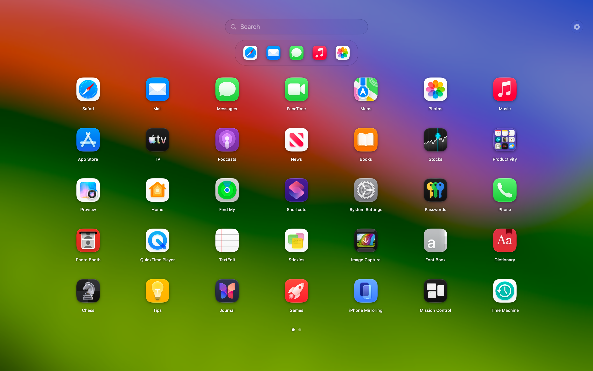
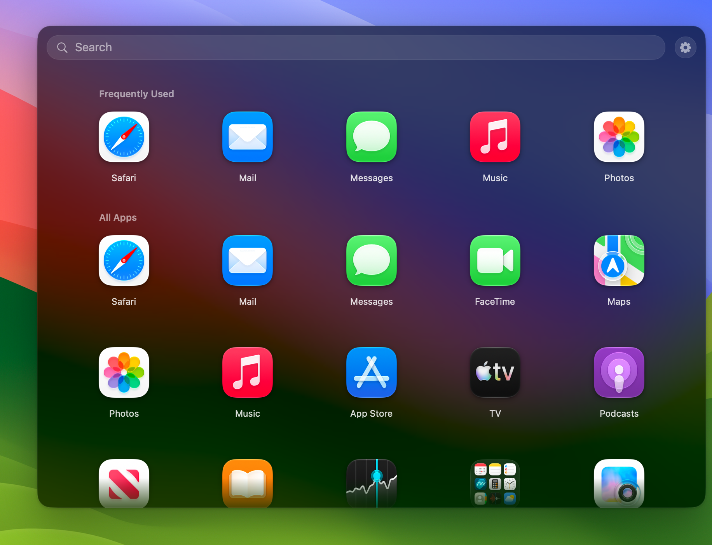
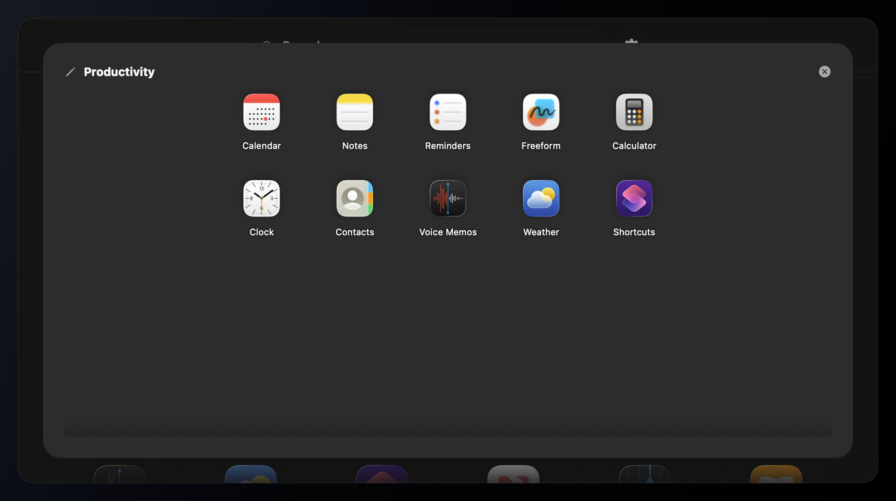

<div align="center">

# OpenLaunchPad

**A native, open-source Launchpad replacement for macOS 26.**

Search, launch, group, and rearrange your apps from a full-screen grid or a compact menu-bar popup.

[](https://github.com/zanecola/OpenLaunchPad/releases/latest)


[](LICENSE)

[Download the latest release](https://github.com/zanecola/OpenLaunchPad/releases/latest) | [Build from source](#build-from-source) | [Report an issue](https://github.com/zanecola/OpenLaunchPad/issues)

</div>



Apple removed the classic Launchpad experience from macOS 26. OpenLaunchPad brings back the parts that made it useful while adding a compact popup, configurable layouts, persistent folders, and familiar macOS controls.

## Highlights

- **Two ways to launch.** Use a paginated full-screen grid or a non-activating popup from the menu bar or Dock.
- **Recent favorites up front.** Apps launched most often through OpenLaunchPad appear in a responsive first row, with recent use breaking frequency ties.
- **Organize naturally.** Drag to reorder, drop apps together to create folders, rename folders, reorder inside them, and drag apps back out.
- **Fast navigation.** Search instantly, use horizontal mouse or trackpad gestures, click page controls, or navigate with the keyboard.
- **Native macOS behavior.** System app icons, materials, context menus, Finder integration, Get Info, and Move to Trash all feel at home.
- **Make it yours.** Configure icon size, labels, full-screen columns, popup dimensions, blur, animation speed, Dock behavior, and a global shortcut.
- **Private by design.** No account, analytics, telemetry, or cloud service. Layout data stays on your Mac.

## Gallery

<table>
  <tr>
    <td width="50%">
      
    </td>
    <td width="50%">
      
    </td>
  </tr>
  <tr>
    <td align="center"><strong>Compact popup</strong><br>Open without leaving the app you are using.</td>
    <td align="center"><strong>Folders</strong><br>Group, rename, reorder, and drag apps back out.</td>
  </tr>
</table>

Screenshots are rendered from the current SwiftUI views with curated macOS system apps.

## Install

### Download a release

1. Download `OpenLaunchPad-<version>.dmg` from [GitHub Releases](https://github.com/zanecola/OpenLaunchPad/releases/latest).
2. Open the DMG and drag **OpenLaunchPad** into **Applications**.
3. Open OpenLaunchPad from Applications.

### First launch on macOS

Current releases are ad-hoc signed, not notarized with an Apple Developer ID. Gatekeeper may block the first launch.

Try Control-clicking OpenLaunchPad in Applications and choosing **Open**. If macOS still blocks it, go to **System Settings > Privacy & Security** and choose **Open Anyway** for OpenLaunchPad.

As a Terminal alternative:

```bash
xattr -dr com.apple.quarantine /Applications/OpenLaunchPad.app
```

Only use the command for a copy downloaded from this repository's official Releases page.

## Requirements

- macOS 26.0 or newer
- A non-sandboxed installation for Launchpad database access and global shortcuts

Building from source additionally requires Xcode with the macOS 26 SDK and SwiftPM.

## Using OpenLaunchPad

### Open the launcher

| Action | Result |
|---|---|
| Click the Dock icon | Opens full-screen or popup mode, depending on Settings |
| Left-click the menu-bar icon | Toggles the compact popup below the icon |
| Right-click the menu-bar icon | Shows Settings, About, and Quit |
| Press your configured global shortcut | Toggles the launcher from any app |
| Click the gear beside Search | Opens Settings |

Launching an app automatically closes OpenLaunchPad so it stays out of your way.

### Navigate

- Start typing as soon as the launcher opens: Search already has focus, in the popup too. It finds apps, including apps inside folders. Exact and prefix matches come first, then apps you use most. Folders whose name matches are listed after the apps.
- A labeled **Frequently Used** row shows up to seven apps and updates after each launch. Turn the row on or off, or clear its local history, under **Settings > General > Suggestions**.
- Use Left/Right, Command-Left/Command-Right, the page arrows, or a horizontal wheel/trackpad gesture in full-screen mode.
- Scroll vertically in popup mode and inside large folders.
- Press Return to open the top search result.
- Press Escape to step back one level: close an open folder, then clear the search, then close the launcher.

### Organize apps

- Drag to the left or right edge of another icon to reorder.
- Drop an app onto the center of another app to create a folder.
- Drop an app onto an existing folder to add it.
- Open a folder and drag apps to reorder them.
- Drag an app outside the expanded folder to move it back to the launcher.
- Edit the folder name directly in its header.

Changes are saved immediately and survive relaunches. Search results are launch-only, so filtering cannot accidentally change your layout.

### App context menu

Right-click an app for:

- Open
- Show in Finder
- Get Info
- Uninstall (Move to Trash, with confirmation)

OpenLaunchPad protects system apps and itself from uninstall. Moving an app to Trash does not remove that app's documents or support files.

## Data and Privacy

OpenLaunchPad does not write to Apple's Dock database.

It reads the legacy Launchpad database in read-only mode when available:

```text
~/Library/Application Support/Dock/desktopproperties.db
```

If the database is unavailable, it scans `/Applications`, `~/Applications`, and `/System/Applications`. Apps use the same localized names as Finder and are sorted by name. Filesystem folders that hold two or more apps are preserved, and duplicate bundle identifiers are removed. These folders are watched, so newly installed or removed apps show up within about a second without restarting OpenLaunchPad.

Your custom pages, folders, and ordering are stored separately:

```text
~/Library/Application Support/OpenLaunchPad/layout.json
```

Reset Layout in Settings asks first and saves the current layout to the `Backups` folder next to `layout.json`. The 10 most recent backups are kept. A `layout.json` that OpenLaunchPad cannot read, for example one written by a newer version, is also moved there instead of being overwritten.

Settings and frequently used app history are stored locally in the `com.openlaunchpad` UserDefaults suite. Usage history contains only bundle IDs, launch counts, and last-launch timestamps for apps opened through OpenLaunchPad. There are no network services, accounts, analytics, or telemetry.

## Build from Source

Clone and enter the repository:

```bash
git clone https://github.com/zanecola/OpenLaunchPad.git
cd OpenLaunchPad
```

Run the test suite:

```bash
swift test
```

Build a local `.app` bundle and launch it:

```bash
./script/build_and_run.sh --verify
```

Create an ad-hoc-signed DMG:

```bash
./script/build_dmg.sh 0.1.0
```

The version becomes the app's bundle version, shown in About. Local builds without a release version report 0.0.0.

Generated artifacts are written to `dist/`.

If SwiftPM cache permissions are restricted, use workspace-local paths:

```bash
env HOME="$PWD/.build" CLANG_MODULE_CACHE_PATH="$PWD/.build/ModuleCache" swift test
```

## Architecture

OpenLaunchPad is a SwiftUI and AppKit application with deliberately small boundaries:

```text
Launchpad database or Applications folders
                    |
                    v
            CompositeDataSource
                    |
                    v
          LaunchpadViewModel
           /              \
          v                v
 LaunchpadLayout      SwiftUI views
 (pure mutations)          |
                          v
              AppKit windows and status item
```

- `LaunchpadLayout` owns deterministic page and folder mutations.
- `LaunchpadViewModel` coordinates state, persistence, icons, and app actions.
- SwiftUI views render full-screen, popup, folder, drag, search, and Settings experiences.
- AppKit handles windows, the status item, system services, and the Carbon global hotkey.
- JSON persistence is versioned and migrates earlier layout formats.

The test suite covers layout invariants, persistence migrations, data sources, view-model orchestration, settings, popup placement, paging input, app actions, and backdrop behavior.

## Known Limitations

- Releases are not yet Developer ID signed or notarized.
- Dragging to a page edge does not automatically switch pages yet.
- Legacy user-created Launchpad folders cannot be recovered when macOS no longer provides `desktopproperties.db`.
- Uninstall moves only the app bundle to Trash; user data remains in place.
- Per-display layouts and iCloud sync are not implemented.

## Contributing

Issues and pull requests are welcome. Before opening a pull request:

1. Describe the user-facing behavior and any macOS-specific tradeoffs.
2. Keep layout rules in `LaunchpadLayout`, orchestration in `LaunchpadViewModel`, reusable interaction in `Views`, and lifecycle behavior in `App` or `Windows`.
3. Add focused tests for deterministic behavior.
4. Run `swift test` and `./script/build_and_run.sh --verify`.

Please use [GitHub Issues](https://github.com/zanecola/OpenLaunchPad/issues) for bugs and feature proposals.

## License

OpenLaunchPad is available under the [MIT License](LICENSE).
